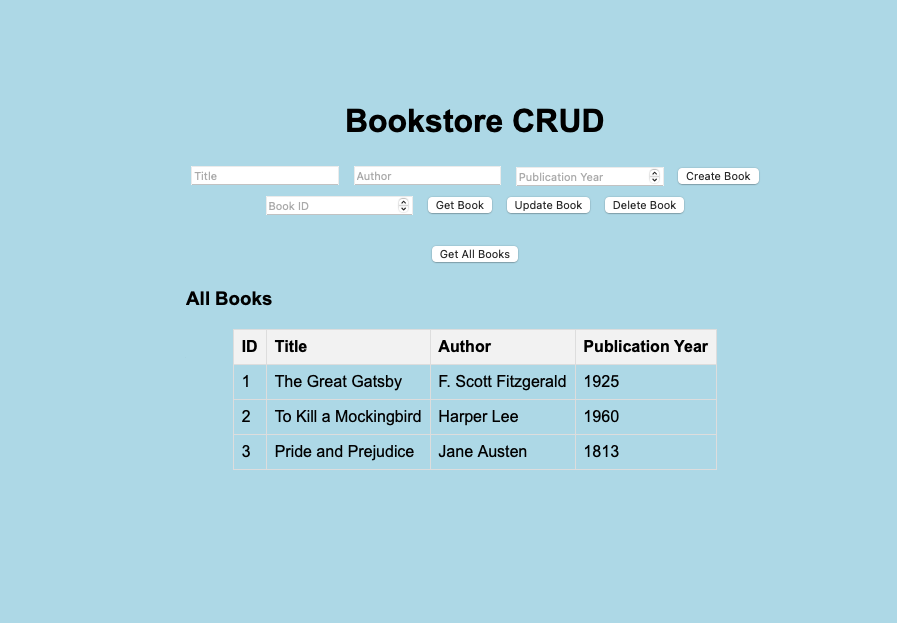

# Bookstore CRUD Application

This project is a simple CRUD (Create, Read, Update, Delete) application for managing books, built with Java Spring Boot for the backend and plain HTML, CSS, and JavaScript for the frontend.



## Features

- Create a new book
- Retrieve a book by its ID
- Update an existing book
- Delete a book by its ID
- Retrieve all books
- Simple frontend

## Technologies Used

- Java Spring Boot 3.2.5
- Spring Data JPA
- H2 In-Memory Database
- HTML, CSS, and JavaScript for the frontend

## Getting Started

### Prerequisites

- Java 17 or later
- Maven

### Installation

1. Clone the repository:
   ```bash
   git clone https://github.com/AhmadMHanif7/Book-Database-API.git
